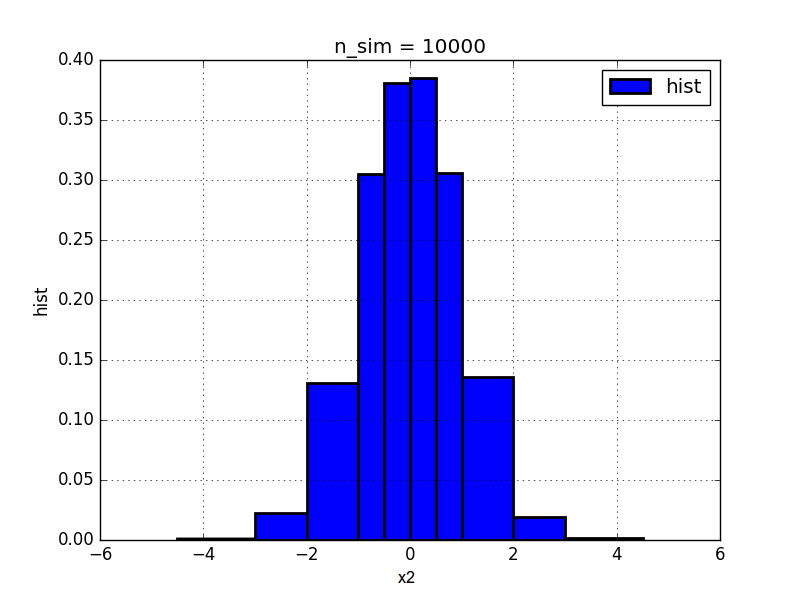
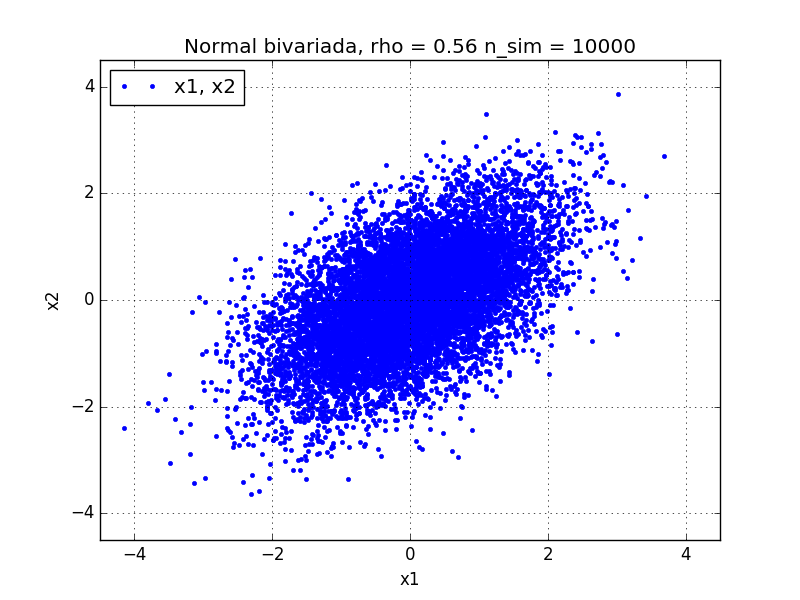
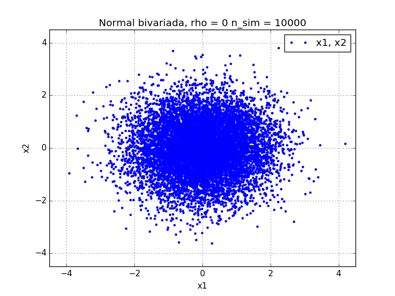

\pagebreak

#1. Análisis y métodos de simulación

El método de Box-Müller, permite la obtención de dos variables aleatorias normales independientes $X_1$ y $X_2$ a partir de dos uniformes independientes $U_1$ y $U_2$. En este sentido, se definen las variables aleatorias:

$$  R := \sqrt[]{2 \textrm{ } log (U_1)}  $$
$$  \Theta := 2 \pi U_2 $$

Se puede observar que como $U_1$ y $U_2$ pertenecen a espacios de probabilidad independientes y las transformaciones que se les aplican son regulares, entonces $R$ y $\Theta$ también son independientes. Entonces,
$$  S := R^2  $$
$$  \implies S = 2 \textrm{ } log (U_1) $$
$$  \implies s = 2 \textrm{ } log (u_1) = g(u_1)$$
$$  \textrm{g es biyectiva} \implies g^{-1}(s) = e^{-\frac{s}{2}} $$

Por el método del jacobiano se obtiene que:

$$  \implies f_{S}(s) = \left.\frac{f_{U_1}(u_1)}{| J_g |}\right|_{u_1=g^{-1}(s)} $$
$$  \implies f_{S}(s) = \frac{1}{2} e^{-\frac{1}{2}s} \cdot 1 \{ s>0\} $$
$$  R = \sqrt[]{S} \quad,\quad  h(s)=\sqrt[]{s} \implies h^{-1}(r)= r^2$$
$$  \implies f_{R}(r) = \left.\frac{f_{S}(s)}{| J_h |}\right|_{s=h^{-1}(r)} = \cdots = r e^{\frac{r^2}{2}} \cdot 1 \{ r>0\} $$
$$ \textrm{y además } f_\Theta (\theta) = \frac{1}{2 \pi} 1 \{ 0 < \theta < 2 \pi \}$$

$$\implies f_{R,\Theta}(r,\theta)= f_{R}(r) f_\Theta (\theta) = \cdots = \frac{r}{2 \pi} e^{-\frac{r^2}{2}} \cdot 1 \{r>0 \quad,\quad 0 < \theta < 2 \pi \}$$

Si ahora se aplica un nuevo cambio de variables :

$$ (Z_1,Z_2) := (R \cos (\Theta), R \sin (\Theta))$$
$$\implies | J_g | = r $$
$$\implies f_{Z_1,Z_2}(z_1,z_2)= \left.\frac{f_{R,\Theta}(r,\theta)}{| J_g |}\right|_{g^{-1}}$$
$$\implies f_{Z_1,Z_2}(z_1,z_2)= \frac{1}{2\pi} e^{-\frac{1}{2}(z_1^2 + z_2^2)}$$
$$\implies Z_1,Z_2 \sim \mathcal{N}(0 , 1) \textrm{ independientes}$$

Como es de interés simular dos normales estándar correlacionadas, se puede construir una matriz de covarianzas $A$ tal que
$$ A =\begin{bmatrix}
\sigma^2_1 & \frac{\rho \sigma^2_1 \sigma^2_2}{2}\\
\frac{\rho \sigma^2_1 \sigma^2_2}{2} & \sigma^2_2
\end{bmatrix} \quad , \quad \textrm{siendo $\rho$ el coeficiente de correlación}$$

Dado que $A$ es definida positiva y hermítica, se puede aplicar la descomposición de Cholesky para A y así obtener las variables aleatorias $X_1$ y $X_2$ normales estándar correlacionadas.


#2. Simulación de Variables Aleatorias

A partir de las distintas implementaciones provistas por la cátedra, para la simulación de normales estándar independientes mediante el método de *Box-Müller* y normales estándar correlacionales mediante la descomposición de *Cholesky* de la matriz de covarianzas, se optó utilizar la implementación `simulacion_normal_bivariada_numpy.py`.

Se presentan en la siguiente tabla las primeras 3 (tres) simulaciones, donde cada columna representan:

**$U_{1,i}$,$U_{2,i}$:** par de V.A. uniformes.

**$Z_{1,i}$,$Z_{2,i}$:** par de V.A. normales estándar independientes.

**$X_{1,i}$,$X_{2,i}$:** par de V.A. normales correlacionadas.


| i |$U_{1,i}$|$U_{2,i}$|$Z_{1,i}$|$Z_{2,i}$|$X_{1,i}$|$X_{2,i}$|
|:-:|--------:|--------:|--------:|--------:|--------:|--------:|
| 1 | 0.065405| 0.996567|  2.33490| -0.05038|  2.33490|  2.23997|
| 2 | 0.426408| 0.986825|  1.30118| -0.10796|  1.30118|  1.22732|
| 3 | 0.216612| 0.722268| -0.30323| -1.72260| -0.30323|-0.744368|

Para las simulaciones se consideró un coeficiente de correlación $\rho = 0{.}965$, obteniendo así una matriz de Covarianza:

$$
Cov =
 \begin{pmatrix}
  \Var[Z_1] & \rho\sqrt{\Var[Z_1] \cdot Var[Z_2]}\\
  \rho\sqrt{\Var[Z_1] \cdot Var[Z_2]} & Var[Z_2] 
 \end{pmatrix}
=
 \begin{pmatrix}
  1 & 0{.}965 \\
  0{.}965 & 1
 \end{pmatrix}
$$

#3. Análisis de los gráficos

Es de interés obtener la función de distribución empírica y el histograma de $X_1$ o de $X_2$ para comparar los gráficos contra lo esperado, si fueran variables aleatorias normales estándar independientes. Dado que $X_1$ y $X_2$ están correlacionadas, se podría esperar que las variables condicionadas $X_1|X_2$ o $X_2|X_1$ tengan una función de distribución y una función densidad distintas a las de una normal estándar. Sin embargo, como se pide en el enunciado, se obtuvieron las funciones de distribución e histograma de las variables $X_1$ y $X_2$ (nótese que no son las mismas variables aleatorias). Los resultados obtenidos para $X_2$ pueden verse en las figuras \label{func_fde} y \label{func_hist}.

Gráfico de la distribución empírica de la variable $X_2$ para $n_{sim} = 10^4$.

{width=80%}


Gráfico de la función histograma de $X_2$ con los valores límite para $n_{sim} = 10^4$: 

{width=80%}

Tal como se observa, las formas que tienen los gráficos tienden a coincidir con la normal estándar. La función de distribución *acumula de forma simétrica probabilidad* desde el comienzo de la simulación hasta el final, teniendo aproximadamente 0.5 a cada lado de su media, que coincide aproximadamente con 0.

La función histograma se asemeja a una forma *discretizada* de la campana de Gauss esperada. Aquí se puede observar que la media esta cercana al 0 y que el desvío (distancia desde la media hasta cubrir la mayor parte de la densidad) tiende a 1.
Para realizar la función histograma se utilizaron los intervalos propuestos por la cátedra en el enunciado del trabajo práctico. Estos intervalos son:

$$[-a_0, -3, -2, -1, -0{.}5, 0, 0{.}5, 1, 2, 3, a_{10}]$$

Donde sean los coeficinetes,

$$a_0 = min(-4{.}5, min(X_1), min(X_2))$$
$$a_{10} = max(-4{.}5, max(X_1) + 10^{-8}, max(X_2) + 10^{-8})$$

Siendo los valores simulados:

$$a_0 = -4{.}50$$
$$a_{10} = 4{.}50$$

$$Frec(X_2) = [   15,   247,  1302,  1481,  1942,  1928,  1489, 1351,   233,    12,]$$
$$Hist(X_2) = [ 0{.}001,   0{.}0247,  0{.}1302,  0{.}2962,  0{.}3884,  0{.}3856,  0{.}2978,  0{.}1351,  0{.}0233,  0{.}0008]$$

Puede observarse que si se usaran mayor cantidad de intervalos cerca del centro de la *campana*, se podría ver con más claridad en el gráfico la tendencia a una función de densidad de una $\mathcal{N}$($0$,$1$).


#4. Tendencia de valores

En el caso evaluado, se considera el coeficiente de correlación como $\rho = \frac{100 + a}{200}$, siendo $a$ el valor de las dos últimas cifras del padrón de cada integrante. 
Se observa la tendencia esperada por la recta de regresión para una distribución normal estándar bivariada.

En los siguientes gráficos, generados a partir de las simulaciones, podemos observar el comportamiento de la normal bivariada obtenida respecto a diferentes coeficientes de correlación, marcando la distribución de puntos $(X_{1,i} , X_{2,i})$ en el plano.

\pagebreak

**Estudiante:** Pablo González\
**Padrón:** 96993

{width=80%}

**Estudiante:** Federico Verstraeten\
**Padrón:** 92892

{width=80%}

Podemos observar en particular, que si el coeficiente de correlación fuera $\rho \sim 0{.}5$, como el ejemplo de la figura \ref{sim_padron_bajo} respecto a los simulados a partir del *padrón* de los integrantes ($\rho \sim 1$), que cuando $\rho$ tiende a 1, más se acercan los puntos del gráfico a formar una recta de pendiente positiva, coincidiendo con la recta de regresión.

{width=80%}

#5. Cálculo de probabilidades. Estimación y comparación de resultados

Como se puede observar en las figuras de la sección anterior, las normales simuladas $(X_1,X_2)$ tienen una distribución conjunta cuyo soporte no es de forma rectangular. En este sentido, se puede descartar la hipótesis de que dichas variables sean independientes. Además, 

$$X_1 , X_2 \textrm{ son independientes} \iff \rho = 0$$

Esto se puede observar en la figura \ref{biv_rho0}, cuyo soporte es "más rectangular". Sin embargo, en las simulaciones solicitadas el coeficiente de correlación $\rho$ toma valores del intervalo $[0{.}5 ; 1]$ y más específicamente tendiendo $\rho \rightarrow 1$ en los casos evaluados, por lo que se puede considerar que $X_1$ y $X_2$ no son independientes. 

{width=80%}

Por lo tanto, se puede pensar que:

$$\mathbb{P}(X_1 \leq 1 \cap X_2 \leq 1) \neq \mathbb{P}(X_1 \leq 1) \cdot \mathbb{P}(X_2 \leq 1)$$

$$\implies \mathbb{P}(X_1 \leq 1 \cap X_2 \leq 1) \neq (\Phi(1))^2$$

En este sentido, a partir del código provisto por la cátedra, se implementó un ciclo que permitiera contar los casos favorables de la simulación (es decir, que cumplieran la condición de la intersección) y dividiendolo por los casos totales (es decir, el tamaño de la simulación). A partir de esto se obtuvieron los siguientes resultados:


|Padrón|$\rho$|Favorables|Totales|$\mathbb{P}(X_1 \leq 1 \cap X_2 \leq 1)$|$(\Phi(1))^2$|
|:------:|:-------:|:----------:|:-------:|:-----------------------:|:--------:|
|  96993 | 0.965   |        8165|    10000|                                  0.8165|      0.70785|
|  92892 | 0.960   |        8067|    10000|                                  0.8067|      0.70785|

En base al ejercicio **5.4)** de la guía de ejercicios, dada una normal bivariada $(X_1,X_2)$, se puede obtener que:

$$X_1|X_2=x_2 \sim \mathcal{N}\left(\mu=\mu_{x_1}+\rho \frac{\sigma_{x_1}}{\sigma_{x_2}} (x_2 - \mu_{x_2}) , \sigma^2 = \sigma_{x_1}^2 (1- \rho ^2)\right)$$

En este caso, se usó $\rho=0{.}965$  y que $X_1$ y $X_2$ son normales estándar. 

$$\implies X_1|X_2=1 \sim \mathcal{N}(\mu=0{.}965 , \sigma^2 = 0{.}068)$$
$$\implies \mathbb{P}(X_1 \leq 1|X_2=1) \approx 0{.}5531$$

Dado que la simulación tiene un rango finito de puntos, se buscó aumentar la cantidad de simulaciones,para que al marginar, la probabilidad no varíe  demasiado y se parezca al valor esperado. Por esto mismo, se aumentó la cantidad de número aleatorios (o pseudo-aleatorios) generados de 10 000 a 1 000 000. Además, se reemplazó la condición de $X_2 = 1$ por una condición más abarcativa para que se aproximaran mejor los puntos de la simulación: se utilizó la condición $0{.}95 \leq X_2 < 1{.}05$. Los resultados obtenidos son:

|Padrón|$\rho$|Favorables|Muestras|$\mathbb{P}(X_1 \leq 1 \text{\textbar} 0{.}95 < X_2 < 1{.}05)$|$\mathbb{P}(X_1 \leq 1 \text{\textbar} X_2=1)$|
|:------:|:-------:|:----------:|:-------:|:------------------------------------:|:-----------------------:|
|  96993 | 0.965   |         146|    10000|                             0.6109|                   0.5531|
|  96993 | 0.965   |       13355|  1000000|                             0.5537|                   0.5531|
|  92892 | 0.960   |         160|    10000|                             0.8067|                   0.5531|
|  92892 | 0.960   |       13562|  1000000|                             0.5553|                   0.5531|

#6. Conclusiones

A lo largo del desarrollo presentado se lograron simular dos variables aleatorias normales estándar correlacionadas, a partir de dos uniformes independientes, mediante el método de Box-Müller y la descomposición de matrices de Cholesky.

Tal como se describió previamente, los soportes de la normal bivariada obtenida difieren con el coeficiente de correlación utilizado, mostrando diferentes tendencias y regresiones posibles tal como se analizó antes. Para coeficientes cercanos a $\rho \sim 1$, se puede ver mejor la tendencia a una recta de pendiente positiva que se puede interpretar como la recta de regresión   dada entre las dos variables aleatorias. 
Dadas las condiciones impuestas por el enunciado, no se pueden observar rectas de regresión con pendiente negativa ($\rho < 0$), ni variable aleatorias independientes ($\rho=0$), sin embargo se pueden observar las diferencias entre las formas que adoptan los soportes, calificando de cierto modo $\emph{"que tan fuerte"}$ es la dependencia entre $X_1$ y $X_2$ (recintos más, o menos, rectangulares).

Por otro lado, también se logró observar la importancia del tamaño de la simulación para realizar comparaciones con los resultados teóricos esperados. Al contar con mayor cantidad de realizaciones del experimento, el conteo de casos favorables sobre casos totales converge al valor calculado teóricamente como se muestra en la sección. Si bien esto es a un costo computacional mayor, se puede apreciar una mayor proximidad al resultado esperado teóricamente. Sin embargo, para algunos puntos (como la comparación con normales independientes) no fue necesario aumentar la resolución de la simulación, ya que ya se podía ver aproximadamente el resultado esperado (por ejemplo, la diferencia entre probabilidades acumuladas).

\pagebreak

#7. Anexo: Implementación código utilizado.

```python
#!/usr/bin/env python
# -*- coding: utf-8 -*-
"""
Simulacion de variables aleatorias normales correlacionadas
Metodo de Box-Muller y luego factorizacion de Cholesky de la matriz de Cov.
Version con uso de numpy
Por Ignacio Bello
"""
#Imports
from __future__ import division
import numpy as np
import matplotlib.pyplot as pl


#--------------------------------------------------------------
#Funciones
#--------------------------------------------------------------

def f_hist(datos, lims, devolver_frecuencia=False):
    """
    Devuelve array con el valor de f_hist correspondiente a cada intervalo

    La funcion se puede definir: 
    f_hist(x) = f_hist[i] * 1{ lims[i] <= x < lims[i+1] }
    
    para graficarla conviene usar el comando hist de matplotlib
    """
    #incializacion
    n_bins = lims.size - 1
    frec_abs = np.zeros(n_bins)
    #conteo frecuencia absoluta
    for i in range(n_bins):
        frec_abs[i] = np.sum( (lims[i] <= datos) * (datos < lims[i+1]) )
    #calculo de funcion histograma
    hist = frec_abs  / (n_sim * (lims[1:] - lims[:-1]))
    #salida de resultados
    if devolver_frecuencia:
        return frec_abs, hist
    else:
        return hist

def fde(datos):
    """Devuevle arrays xx e yy para graficar una fde con step(xx,yy)"""
    n_datos = datos.size
    xx = datos.copy()
    xx.sort()
    yy = np.linspace(0, 1, n_datos+1)
    xx = np.hstack([xx, xx[-1]])
        #se agrega un punto extra para que cierre el dibujo    
    return xx, yy
    

def box_muller(UU):
    """
    Devuelve ZZ array (n, 2) de normales estandar independientes
    UU debe ser array (n, 2)
    """
    r = np.sqrt(-2*np.log(UU[:, 0]))
    theta = 2 * np.pi * UU[:, 1]
    ZZ = r * np.array([np.cos(theta), np.sin(theta)])
    return ZZ.T
    
def norm_biv(ZZ, Mu, Cov):
    """
    Devuelve XX array (n, 2) de normales correlacionadas
    ZZ debe ser array (n, 2)    
    Mu debe ser array (2,1), Cov array (2,2)
    """    
    #Descomposicion cholesky matrix 2x2    
    A = np.linalg.cholesky(Cov)
    XX = (A.dot(ZZ.T)+Mu).T
    return XX

#--------------------------------------------------------------
#Programa principal
#--------------------------------------------------------------

#Datos
n_sim = int(1e4) #Numero de simulaciones
mu1 = 0.0
mu2 = 0.0
var1 = 1.0
var2 = 1.0
#rho = 0.8
rho = (100+93)/200     # AGREGADO POR PABLO J. GONZALEZ

#limites para histogramas - Modificar a gusto
aa = np.array([-4.5, -3., -2., -1., -0.5, 0., 0.5, 1., 2., 3., 4.5])
corregir_lims = True #Si la muestra escapa a los limites los amplia
eps = 1e-8

#Simulacion 
UU = np.random.rand(n_sim, 2) #(se podrian leer desde archivo)
ZZ = box_muller(UU)
Mu = np.array([[mu1], [mu2]])
Cov = np.array([ [var1, rho*(var1*var2)**0.5], 
                 [rho*(var1*var2)**0.5, var2] ])
XX = norm_biv(ZZ, Mu, Cov)

##################
# EXPORTACION DE DATOS DE LAS SIMULACIONES # AGREGADO POR PABLO J. GONZALEZ
np.savetxt("Uniformes.csv", UU, delimiter=";", fmt="%.5e")
np.savetxt("Normales_indep.csv", ZZ, delimiter=";", fmt="%.5e")
np.savetxt("Matriz_cov.csv", Cov, delimiter=";", fmt="%.5e")
np.savetxt("Normal_biv.csv", XX, delimiter=";", fmt="%.5e")
##################  
# CICLOS DE CONTADORES, CALCULOS DE PROB COMO LAPLACE 
# AGREGADO POR PABLO J. GONZALEZ
count=0
for j in range(n_sim):
  if (XX[j,0]<=1) and (XX[j,1]<=1):
    count +=1
    
print "casos favorables punto 5:",count 
print "casos totales punto 5:",n_sim 
print "prob punto 5:",count/n_sim 

count=0
aux=0
for j in range(n_sim):
  if (XX[j,1]>=0.95) and (XX[j,1]<1.05):
    aux+=1
    if (XX[j,0]<=1):
      count +=1

print "casos favorables punto 6:",count 
print "casos totales punto 6:",aux 
print "prob punto 6:",count/aux
##################

#Funciones histograma y distribucion empirica
if corregir_lims:
    aa[0] = np.min([aa[0], XX.min()])
    aa[-1] = np.max([aa[-1], XX.max() + eps])

frec_x1, hist_x1 = f_hist(XX[:,0], aa, True)
frec_x2, hist_x2 = f_hist(XX[:,1], aa, True)

print('Limites: ' + str(aa))
#print('Frec. X1: ' + str(frec_x2))
#print('Hist. X1: ' + str(hist_x2))
print('Frec. X2: ' + str(frec_x2))
print('Hist. X2: ' + str(hist_x2))

# AGREGADO POR PABLO J. GONZALEZ
#np.savetxt("Limites.csv", aa, delimiter=";", fmt="%.2e")
#np.savetxt("Frec. X2.csv", frec_x2, delimiter=";", fmt="%.4e")
#np.savetxt("Hist. X2.csv", hist_x2, delimiter=";", fmt="%.4e")

xx1_fde, yy1 = fde(XX[:,0])
xx2_fde, yy2 = fde(XX[:,1])

#figura1 = pl.figure()
#pl.step(xx1_fde, yy1, label='Fde', lw=2)
#pl.grid()
#pl.legend(loc='best')
#pl.xlabel('x1')
#pl.ylabel('Fde')
#pl.title('n_sim = '+str(n_sim))
#pl.xlim(-3., 3.)
#figura1.show()    

figura2 = pl.figure()
pl.step(xx2_fde, yy2, label='Fde', lw=2)
pl.grid()
pl.legend(loc='best')
pl.xlabel('x2')
pl.ylabel('Fde')
pl.title('n_sim = '+str(n_sim))
pl.xlim(-3., 3.)
figura2.show()
#figura2.savefig('foo2.png')    # AGREGADO POR PABLO J. GONZALEZ    

#figura3 = pl.figure()
#pl.hist(XX[:,0], bins = aa, normed=True, label='hist', lw=2)
#pl.grid()
#pl.legend(loc='best')
#pl.xlabel('x1')
#pl.ylabel('hist')
#pl.title('n_sim = '+str(n_sim))
#figura3.show()

figura4 = pl.figure()
pl.hist(XX[:,1], bins = aa, normed=True, label='hist', lw=2)
pl.grid()
pl.legend(loc='best')
pl.xlabel('x1')
pl.ylabel('hist')
pl.title('n_sim = '+str(n_sim))
figura4.show()
#figura4.savefig('foo4.png')    # AGREGADO POR PABLO J. GONZALEZ

figura5 = pl.figure()
pl.plot(XX[:,0], XX[:,1], '.', label='x1, x2', lw=1)
pl.grid()
pl.legend(loc='best')
pl.xlabel('x1')
pl.ylabel('x2')
pl.xlim(-4.5, 4.5)
pl.ylim(-4.5, 4.5)
pl.title('Normal bivariada, rho = '+ str(rho) + ' n_sim = '+str(n_sim))
figura5.show()
figura5.savefig('foo5_test.png')    # AGREGADO POR PABLO J. GONZALEZ
```

