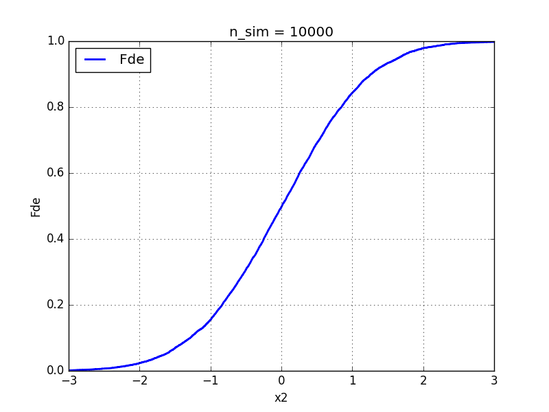

\pagebreak

*Objetivo: Lorem ipsum dolor sit amet, consectetur adipiscing elit. Fusce sagittis augue sit amet metus tristique lacinia. Curabitur sit amet tortor accumsan, hendrerit purus sit amet, volutpat dui. In molestie hendrerit elementum. Phasellus aliquam tortor nec risus auctor ullamcorper. Pellentesque et diam at metus elementum sagittis. Ut dapibus vulputate efficitur. Praesent nec tortor et mi gravida commodo a nec metus. Maecenas semper ut leo eu cursus.*

#1. Tabla de simulaciones

A partir de las distintas implementaciones provistas por la cátedra, para la simulación de normales estándar independientes mediante el métodode *Box-Muller* y normales estándar correlacionales mediante la descomposición de *Cholesky* de la matriz de covarianzas, se optó utilizar la implementación `simulacion_normal_bivariada_numpy.py`.

Se presentan en la siguiente tabla las primeras 3 (tres) simulaciones, donde cada columna representan:

**$U_{1,i}$,$U_{2,i}$:** par de V.A. uniformes.

**$Z_{1,i}$,$Z_{2,i}$:** par de V.A. normales estándar independientes.

**$X_{1,i}$,$X_{2,i}$:** par de V.A. normales correlacionadas.

| i |$U_{1,i}$|$U_{2,i}$|$Z_{1,i}$|$Z_{2,i}$|$X_{1,i}$|$X_{2,i}$|
|:-:|--------:|--------:|--------:|--------:|--------:|--------:|
| 1 | 0.065405| 0.996567|  2.33490| -0.05038|  2.33490|  2.23997|
| 2 | 0.426408| 0.986825|  1.30118| -0.10796|  1.30118|  1.22732|
| 3 | 0.216612| 0.722268| -0.30323| -1.72260| -0.30323|-0.744368|

Para las simulaciones se consideró un coeficiente de correlación $\rho = 0{.}965$, obteniendo así una matriz de Covarianza:

$$
Cov =
 \begin{pmatrix}
  \Var[Z_1] & \rho\sqrt{\Var[Z_1] \cdot Var(Z_2)}\\
  \rho\sqrt{\Var[Z_1] \cdot Var(Z_2)} & Var(Z_2) 
 \end{pmatrix}
=
 \begin{pmatrix}
  1 & 0{.}965 \\
  0{.}965 & 1
 \end{pmatrix}
$$

#2. Función de distribución empírica

Por medio de la simulación se obtienen el gráfico de la distribución empírica de la variable $X_2$ para $n_{sim} = 10^4$.

{width=80%}

#3. Función histograma

Función histograma de $X_2$ con los valores límite para $n_{sim} = 10^4$: 

$$[-a_0, -3, -2, -1, -0{.}5, 0, 0{.}5, 1, 2, 3, a_{10}]$$

Donde sean los coeficinetes,

$$a_0 = min(-4{.}5, min(X_1), min(X_2))$$
$$a_{10} = max(-4{.}5, max(X_1) + 10^{-8}, max(X_2) + 10^{-8})$$

{width=80%}

#4. Recta de regresión

Se observa la tendencia esperada por la recta de regresión para una distribución normal estándar bivariada.
También se puede notar que a medida que el coeficiente de correlación $\rho$ se aleja de cero, los puntos del gráfico se acercan más a la recta de regresión. 

En el caso evaluado donde $\rho = \frac{100 + a}{200}$, siendo $a$ el valor de las dos últimas cifras del padrón de cada integrante, el cuanto más cerca está $\rho$ de 1, más se acercan los puntos del gráfico a formar una recta de pendiente positiva.

A continuación se presentan los gráficos correspondientes a cada padrón de los integrantes, marcando la distribución de  puntos $(X_{1,i} , X_{2,i})$ en el plano.

\pagebreak

**Estudiante:** Pablo González\
**Padrón:** 96993

{width=80%}

**Estudiante:** Lucía Kasman\
**Padrón:** 97112

{width=80%}

**Estudiante:** Leonardo Taffarel\
**Padrón:** 97066

{width=80%}

**Estudiante:** Federico Verstraeten\
**Padrón:** 92892

{width=80%}

#5. Estimación y comparación con $(\phi(1))^2$

Como se puede observar en las figuras (REFERENCIAR FIGURAS NORMALES BIV),  las normales simuladas $(X_1,X_2)$ tienen una distribución conjunta cuyo soporte no es de forma rectangular. En este sentido, se puede descartar la hipótesis de que sean independientes. Además, 

$$X_1 , X_2 \textrm{ son independientes} \iff \rho = 0$$

Esto se puede observar en la figura (REFERENCIAR FIG NORMAL BIV RHO 0), cuyo soporte es "más rectangular". Sin embargo, en las simulaciones pedidas el coeficiente de correlación $\rho$ es cercano a 1 en todos los casos, por lo que $X_1$ y $X_2$ no son independientes. Por lo tanto, se puede pensar que:

$$\mathbb{P}(X_1 \leq 1 \cap X_1 \leq 1) \neq \mathbb{P}(X_1 \leq 1) \cdot \mathbb{P}(X_2 \leq 1)$$

$$\implies \mathbb{P}(X_1 \leq 1 \cap X_1 \leq 1) \neq (\Phi(1))^2$$

En este sentido, se implementó un ciclo que contara los casos favorables de la simulación (es decir, que cumplieran la condición de la intersección) y se los dividió por los casos totales (es decir, el tamaño de la simulación). Los resultados obtenidos son :\\

(SI PODÉS, PRESENTA LOS RESULTADOS EN UNA TABLA QUE TENGA PADRON USADO, RHO, CASOS FAVORABLES Y TOTALES, PROBABILIDAD CALCULADA Y EL $(\Phi(1))^2$ , QUE ES EL MISMO PARA TODAS LAS SIM)

  
#6. Estimación probabilidad condicional (Bonus)

En base al ejercicio **5.4)** de la guía de ejercicios, dada una normal bivariada $(X_1,X_2)$, se puede obtener que:

$$X_1|X_2=x_2 \sim \mathcal{N}\left(\mu=\mu_{x_1}+\rho \frac{\sigma_{x_1}}{\sigma_{x_2}} (x_2 - \mu_{x_2}) , \sigma^2 = \sigma_{x_1}^2 (1- \rho ^2)\right)$$

En este caso, se usó $\rho=0{.}965$  y que $X_1$ y $X_2$ son normales estándar. 

$$\implies X_1|X_2=1 \sim \mathcal{N}(\mu=0{.}965 , \sigma^2 = 0{.}068)$$
$$\implies \mathbb{P}(X_1 \leq 1|X_2=1) \approx 0{.}5531$$

Dado que la simulación tiene un rango finito de puntos, se buscó aumentar la cantidad de simulaciones,para que al marginar, la probabilidad no varíe  demasiado y se parezca al valor esperado. Por esto mismo, se aumentó la cantidad de número aleatorios (o pseudo-aleatorios) generados de 10 000 a 1 000 000. Además, se reemplazó la condición de $X_2 = 1$ por una condición más abarcativa para que se aproximaran mejor los puntos de la simulación: se utilizó la condición $0{.}95 \leq X_2 < 1{.}05$. Los resultados obtenidos son:

(PRESENTAR RESULTADOS EN TABLA CON CASOS FAVORABLES, CASOS TOTALES , PROB CALCULADA Y PROB ESPERADA. SI QUERES PODEMOS PONER LO QUE MANDE DE LAS SIMULACIONES DE 10 000 MUESTRAS Y ALGUNA DIFERENCIA O ERROR DE SIMULACION)
